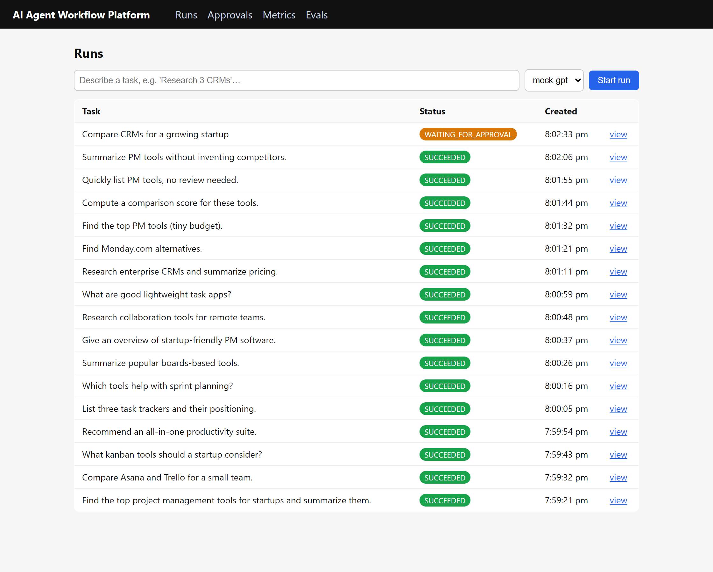
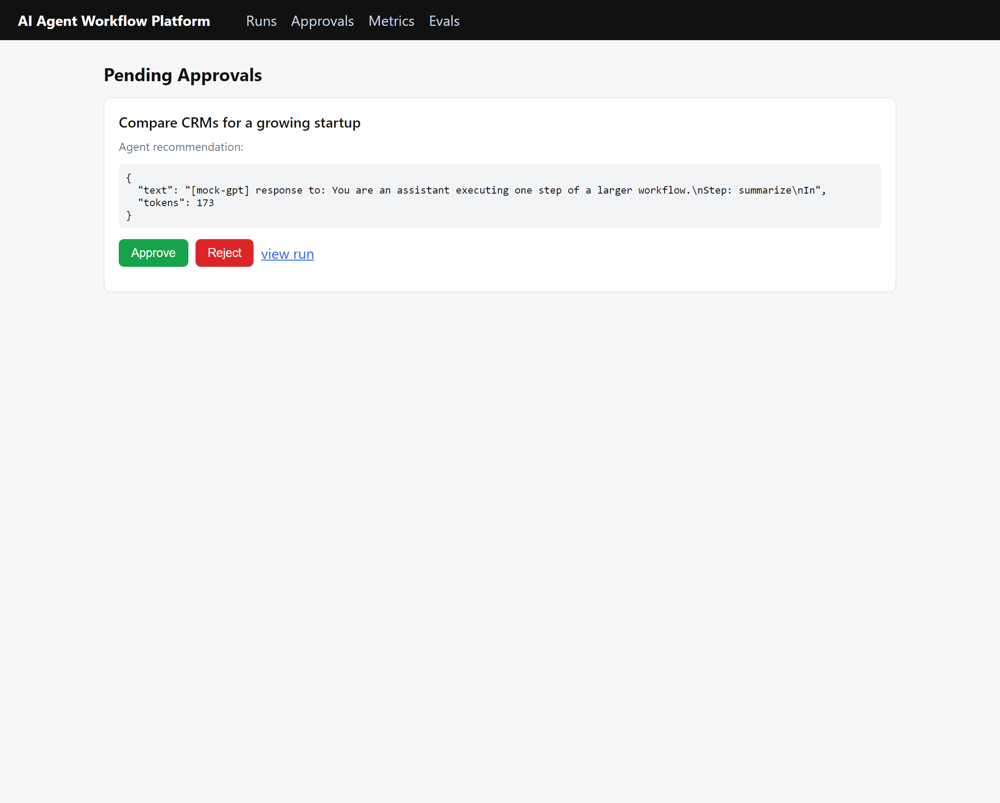
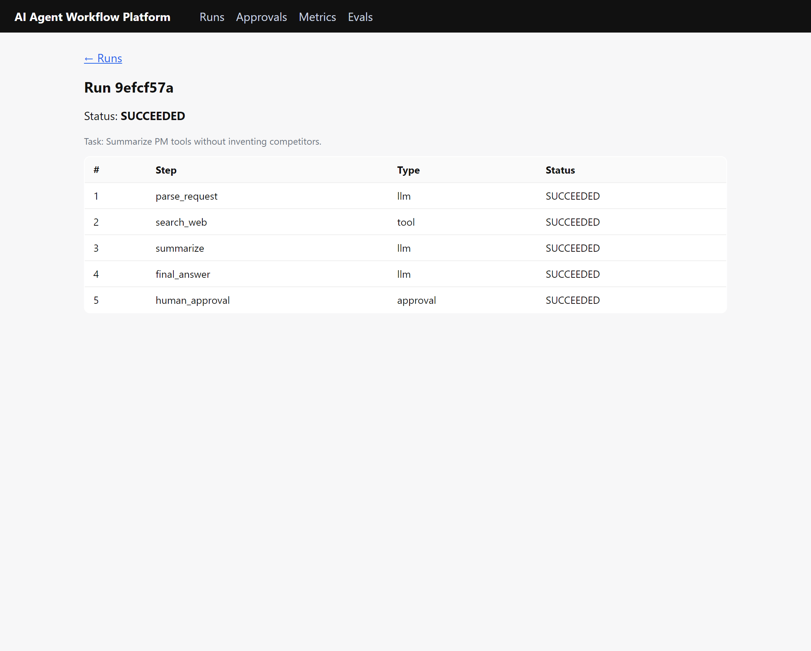
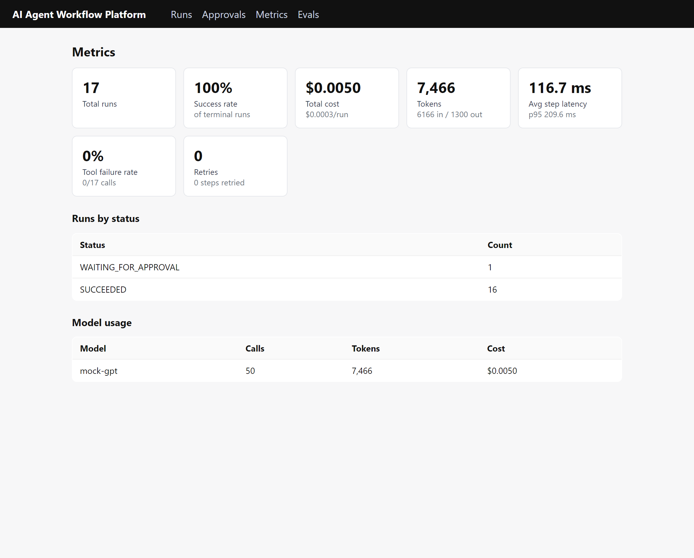
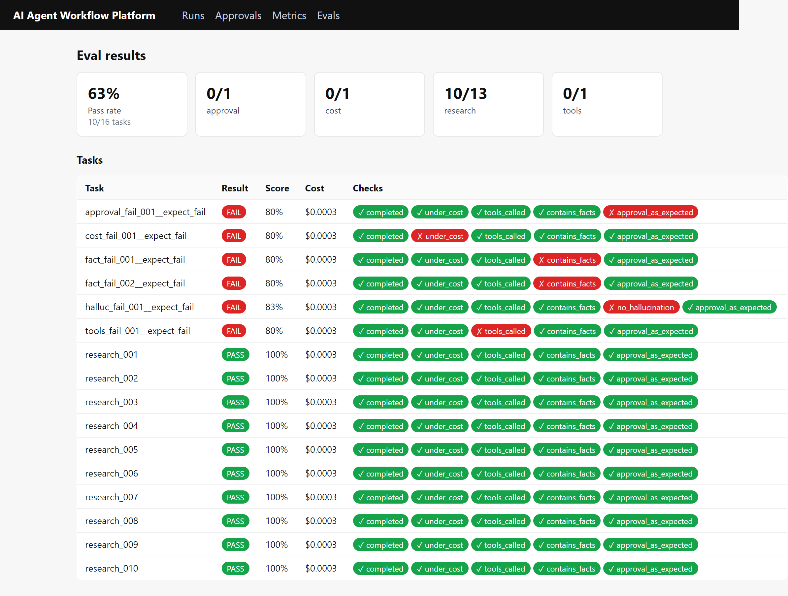

# AI Agent Workflow Platform

Run AI tasks as **durable workflows**. Submit a high-level task and the platform executes
it as a sequence of steps — LLM calls, tool calls, and human approvals — that survive
worker crashes, retry safely, and never re-run a side effect twice.

Built on FastAPI, Celery, Postgres, and Redis, with OpenTelemetry tracing, a metrics
dashboard, and an automated evaluation harness.

## Demo

<!-- A chaos-test GIF can be dropped here (save under docs/media/chaos-demo.gif):
 -->

**Runs** — submit a task, pick a model, watch live status:



**Approvals** — a run paused for human review, with the agent's recommendation:



**Run detail** — the per-step timeline:



**Metrics** — success rate, cost per run, p95 step latency, model usage:



**Evals** — pass rate and per-check results across the benchmark suite:



## Features

- **Durable execution engine** on Celery + Postgres. Steps commit before executing, so a
  crash leaves a recoverable trace; retries use exponential backoff.
- **Effectively-once side effects** via deterministic idempotency keys — a resumed or
  retried step never re-fires its side effect.
- **Crash recovery** — `acks_late` redelivery plus a periodic beat sweeper that resumes
  runs stranded by a dead worker.
- **Human-in-the-loop approval gates** — runs pause durably; reviewers approve or reject
  from the dashboard, with a full audit trail. Decisions are idempotent.
- **Tool calling and LLM steps** — a tool registry with audited tool calls and a per-call
  cost/token ledger.
- **Observability** — OpenTelemetry distributed tracing to Jaeger (one run = one trace
  tree) and a SQL-backed metrics dashboard.
- **Automated evaluation** — a runner replays a benchmark suite through the live API and
  scores each run across six quality and cost dimensions.

## Architecture

```
 Browser ─▶ Next.js dashboard ─▶ FastAPI ──enqueue(name)──▶ Redis ──▶ Celery worker
                                    │                                    │ engine loop:
                                    │ writes run row                     │  commit step → execute
                                    ▼                                    ▼  (LLM / tool, idempotent)
                              ┌──────────────┐   reads/writes    ┌──────────────┐
                              │   Postgres   │ ◀──────────────▶  │   Worker     │
                              │ runs/steps/  │  source of truth  │  + beat      │
                              │ approvals/…  │                   │   sweeper    │
                              └──────────────┘                   └──────┬───────┘
       every span (API ▸ task ▸ step ▸ llm/tool ▸ db) ──▶ OpenTelemetry ─▶ Jaeger
```

Postgres is the source of truth; the queue only schedules work. See
[`docs/architecture.md`](docs/architecture.md) for the data model, run state machine, and
the durable-execution mechanism in detail.

**Stack:** Next.js · FastAPI · Postgres · Redis · Celery · OpenTelemetry → Jaeger · Docker.

## Configuration

The LLM provider is set in `.env` and works with any OpenAI-compatible API. It runs on a
deterministic mock by default (no key required, $0):

```
LLM_PROVIDER=mock            # mock | openai | groq | openrouter | ollama | anthropic
LLM_API_KEY=
LLM_MODEL=mock-gpt
LLM_MODELS=mock-gpt          # comma-separated list shown in the run form's model picker
```

To use a real model, set the provider, key, and model — for example Groq:

```
LLM_PROVIDER=groq
LLM_API_KEY=gsk_...
LLM_MODEL=llama-3.1-8b-instant
```

(Ollama needs no key; for hosted providers a missing key falls back to the mock.)

## Quickstart

Prereqs: Docker, Python 3.12+, Node 20+.

```bash
cp .env.example .env
python3 -m venv .venv && source .venv/bin/activate
pip install -r apps/api/requirements.txt -r apps/worker/requirements.txt
pip install -e packages/shared
npm install --prefix apps/web
```

**One command** — brings up infra, runs migrations, and launches worker, beat, API, and web:

```bash
./scripts/dev.sh        # tear down with ./scripts/down.sh   (or: make dev / make down)
```

<details><summary>Or start the processes manually (5 terminals)</summary>

```bash
# 1. Infra (Postgres, Redis, Jaeger)
docker compose -f infra/docker-compose.yml --env-file .env up -d

# 2. Worker  (from apps/worker, venv active)
PYTHONPATH=. python -m celery -A celery_app worker --loglevel=info

# 3. Beat — the resume-sweeper scheduler
PYTHONPATH=. python -m celery -A celery_app beat --loglevel=info

# 4. API  (from apps/api)
PYTHONPATH=. python -m uvicorn main:app --reload --port 8000

# 5. Web dashboard  (from apps/web)
npm run dev      # http://localhost:3000
```

</details>

Apply DB migrations from `packages/shared`: `alembic upgrade head`.

Run the eval suite (with the stack up): `python packages/evals/runner.py` — replays
`benchmarks/tasks.json` through the live API, scores each task, and writes results to
`eval_runs` (visible at http://localhost:3000/evals).

> Windows: use `scripts/dev.ps1` / `scripts/down.ps1` (the worker needs `--pool=solo` there).

## Project layout

```
apps/
  api/        FastAPI service — run submission, approvals, metrics, evals
  worker/     Celery worker — the engine, tools, LLM client, resume sweeper
  web/        Next.js operator dashboard
packages/
  shared/     SQLAlchemy models, Alembic migrations, config (installable package)
  evals/      benchmark runner + scoring
infra/        docker-compose (Postgres, Redis, Jaeger)
benchmarks/   benchmark task suite (tasks.json)
```

## Documentation

- [`docs/architecture.md`](docs/architecture.md) — components, data model, run state
  machine, and the durable-execution mechanism.
- [`CONTRIBUTING.md`](CONTRIBUTING.md) — development setup and contribution guide.

## License

[MIT](LICENSE) © 2026 Himadri S Chatterjee. Contributions welcome — see
[`CONTRIBUTING.md`](CONTRIBUTING.md).
